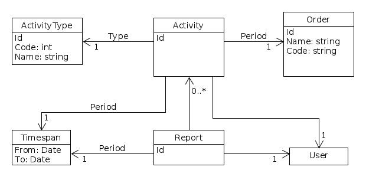
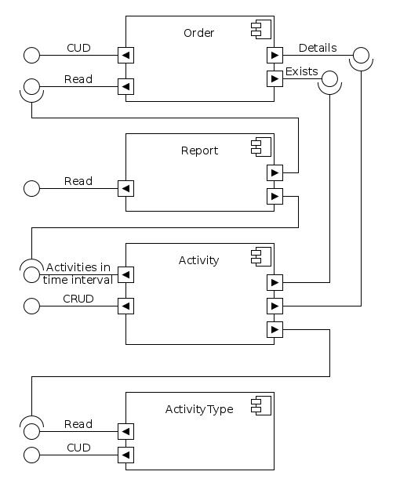

# Entities

1. User
1. Report
1. Activity
1. ActivityType
1. Order

# Domains

1. User
1. Report-Activity
1. Order

# Requirements

* [ ] As an User, I can create a new Activity
* [ ] As an User, I can delete an Activity I created
* [ ] As an User, I can update an Activity I created
* [ ] As an User, I can read an Activity I created
* [ ] As an User, I can create a new ActivityType
* [ ] As an User, I can delete an ActivityType I created
* [ ] As an User, I can update an ActivityType I created
* [ ] As an User, I can read an ActivityType I created
* [ ] As an User, I can read the Report for each month
* [ ] As an User, I can create a new Order
* [ ] As an User, I can read an Order I created
* [ ] As an User, I can update an Order I created
* [ ] As an User, I can delete an Order I created

# Architecture

## Services

1. **Order**
1. **Activity**
1. **Report**

### Implementation choices

1.**Soft-Delete**: never delete an entry, use a `Deleted` flag

## API Gateways

## Front-End
